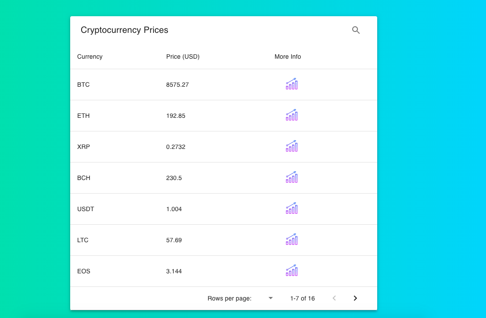

## Cryptocurrency Price Tracker Using Go and React

To run, first run the "main.go" server
Then run the react application

## Details
React makes call to http://localhost:3001/prices and fetches JSON data of currencies and prices.
Currencies and prices are parsed into MUIDataTable and shown to the user.
Click the statistical chart icon next to each entry on the table to pull up another website on more information for that specific currency.

## Screenshot

